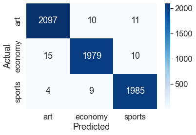

# NLP-Articles-Classifier
An END to End NLP pipeline for articles titles classification

## Table of Contents

* [Motivation](#motivation)
* [Project Tree](#project-tree)
* [Technologies Used](#technologies-used)
* [Project Pipeline](#project-pipeline)
* [Results](#results)
* [Resources](#resources)

## Motivation

While I'm studying the 'Sequence Models' course of 'Deep Learning Specialization',
I've got highly motivated to start doing a Natural Language processing project and gain more hands on experience required the whole process.

## Project Tree

├── data collecting

    ├── articles_scraper.ipynb 
    ├── economy_2.csv
    ├── sports_2.csv
    ├── arts_2.csv
    

├── data cleaning

    ├── data_cleaning.ipynb 
    ├── clean_df.csv

├── data preprocessing

    ├── text_preprocessing.ipynb 
    ├── final_df_1.csv
    ├── final_df_2.csv

├── model building and evaluation

    ├── ml_models.ipynb 
    ├── LSTM_model.ipynb

└── README.md 

## Technologies Used

* Jupyter Notebook (Python3)
* Web Scraping (BeautifulSoup, requests)
* Text Preprocessing (NLTK)
* Text Classification (LSTM, Naive Bayes, Logistic Regression)
* Numpy
* Pandas
* Matplotlib
* Seaborn

## Project Pipeline

1. Data Collecting/Scraping:
    
    I've decided to build my own dataset for once. So, I put up a python code to scrape data from an egyptian newpapers [english ahram online](https://english.ahram.org.eg). I scraped different articles titles of different categories (Arts, Economy, Sports) which summed up to 30,000 records in total.
    
2. Data Cleaning: 
    
    A very simple cleaning is done before entering the preprocessing stage.
    We have one mega csv file containing our 30,000 records.At first, remove the useless spaces (leading and trailing).
    Secondly, remove any duplicate records if exists.
    
3. Text Preprocessing: This step has a lot of important processes to implement such as
    
    * Remove punctuation symbols (!"#$%&'()*+, -./:;<=>?@[\]^_`{|}~ )
    
    * Lower all the words to have a uniform representation
    
    * Tokenize all the sentences (convert every sentence to a list of words)

    * Remove stopwords from tokenized text

    * Apply stemming process on text

    * Apply Lemmatization on text

    * Save preprocessed text into a final csv.

4.  Model Building and Evaluation:
    
    I started by using simple machine learning classifiers (Naive Bayes, Logistic Regression)
    and got a pretty got results. Also, implemented a LSTM model to see what is the possible extreme in terms 
    of classification accuracy.

## Results

Confusion Matrix of Machine Learning Models:

LSTM Training and Validation Losses:

LSTM Training and Validation Accuracies:

## Resources

- a special thank goes to AhmedSamy96's repo on github, I've used some of his codes but built my own models and used my tweaks.

     [AhmedSamy's  Repo](https://github.com/Ahmedsamy96/Article-classifiers-NLP)

- [Analytics-vidhya medium post](https://medium.com/analytics-vidhya/nlp-tutorial-for-text-classification-in-python-8f19cd17b49e#:~:text=Text%20classification%20is%20one%20of,in%20a%20cost%2Deffective%20manner.)

- [MachineLearningMastery for Sequence Classification article](https://machinelearningmastery.com/sequence-classification-lstm-recurrent-neural-networks-python-keras/)

